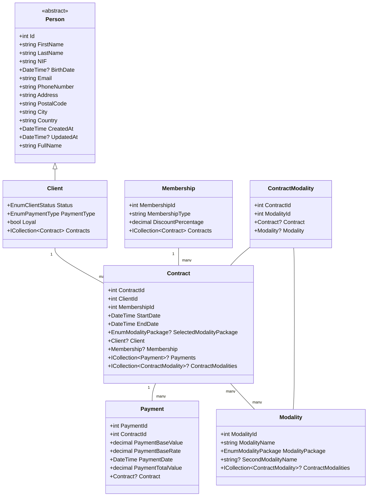

# Gym Management System

## Project Overview
A comprehensive full-stack web application for managing gym operations including memberships, contracts, payments, and modalities. Built with ASP.NET Core MVC, this system implements best practices in software architecture and design patterns to provide a robust, maintainable solution for gym business management.

## Key Technical Highlights

### Architecture & Technologies
- **ASP.NET Core MVC 6.0**: Modern web framework for building server-side web applications
- **Entity Framework Core**: ORM for database operations with Code First approach
- **SQL Server**: Relational database management system for data storage
- **Dependency Injection**: Built-in IoC container for loose coupling
- **Repository Pattern**: For data access abstraction
- **Clean Architecture**: Separation of concerns with layered design

### Database Design
- Complex relational database schema with properly designed entities
- Entity Framework Code First approach with migrations
- Many-to-many relationships (ContractModalities)
- Navigation properties for entity relationships
- Fluent API configuration for complex mappings
- Data seeding for initial application state

### Backend Features
- **CRUD Operations**: Complete Create, Read, Update, Delete operations for all entities
- **Complex Business Logic**: Sophisticated rules for contracts, payments, and memberships
- **Asynchronous Programming**: Using async/await for non-blocking operations
- **Service Layer Pattern**: Business logic encapsulation in dedicated services
- **Interface-based Programming**: For loose coupling and testability
- **Custom Validation**: Data integrity rules at multiple levels
- **Payment Processing**: Flexible payment system with different calculation modes

### Models & Entities
- **Client**: Inherits from Person base class, manages gym member data
- **Contract**: Links clients with memberships and modalities
- **Membership**: Defines membership types and discount structures
- **Modality**: Represents different gym activities and packages
- **Payment**: Handles financial transactions with flexible calculation
- **ContractModality**: Junction entity for many-to-many relationships

### Software Engineering Practices
- **SOLID Principles**: Single responsibility, Open-closed, Liskov substitution, Interface segregation, Dependency inversion
- **DRY Principle**: Code reuse and elimination of redundancy
- **Separation of Concerns**: Clear boundaries between application layers
- **Interface Segregation**: Focused interfaces for specific behaviors
- **Data Annotations**: For validation and metadata specification
- **Strongly-typed Views**: For compile-time checking

## Application Structure

```
GymManagementSystem/
├── Controllers/           # MVC Controllers handling HTTP requests
├── Models/                # Domain entities and view models
├── Views/                 # Razor views for the UI
├── DAL/                   # Data Access Layer with DbContext
├── Services/              # Business logic implementation
├── Interfaces/            # Contracts for services and repositories
├── Enums/                 # Enumeration types
├── Migrations/            # EF Core database migrations
└── wwwroot/               # Static files (CSS, JS, images)
```

## Class Diagram


## Entity Relationships
- **Client-Contract**: One-to-many (A client can have multiple contracts)
- **Membership-Contract**: One-to-many (A membership type can be used in multiple contracts)
- **Contract-Payment**: One-to-many (A contract can have multiple payments)
- **Contract-Modality**: Many-to-many (Contracts can include multiple modalities)

## Features

### Client Management
- Register new clients with personal information
- Track client status (Active, Inactive, etc.)
- Manage loyalty status and payment preferences
- View client contract history

### Membership Management
- Create and manage different membership types
- Configure discount percentages for each membership
- Associate memberships with contracts

### Contract Management
- Create contracts linking clients with memberships
- Select modality packages for contracts
- Set contract duration (start and end dates)
- View all contracts with filtering options

### Modality Management
- Manage different gym activities/services
- Configure modality packages (single, paired, all-inclusive)
- Associate modalities with contracts

### Payment Processing
- Calculate payments based on client type and membership
- Support different payment methods
- Apply loyalty discounts automatically
- Track payment history

## Technical Requirements
- .NET 6.0 or higher
- SQL Server (or SQL Server Express)
- Modern web browser

## Installation & Setup
1. Clone the repository
2. Update the connection string in appsettings.json to your SQL Server instance
3. Run Entity Framework migrations to create the database:
   ```
   dotnet ef database update
   ```
4. Build and run the application:
   ```
   dotnet build
   dotnet run
   ```

## Usage
Access the application through your web browser at `https://localhost:5001` or `http://localhost:5000` (ports may vary).

## License
© 2024 Claudia Souza. All rights reserved.
